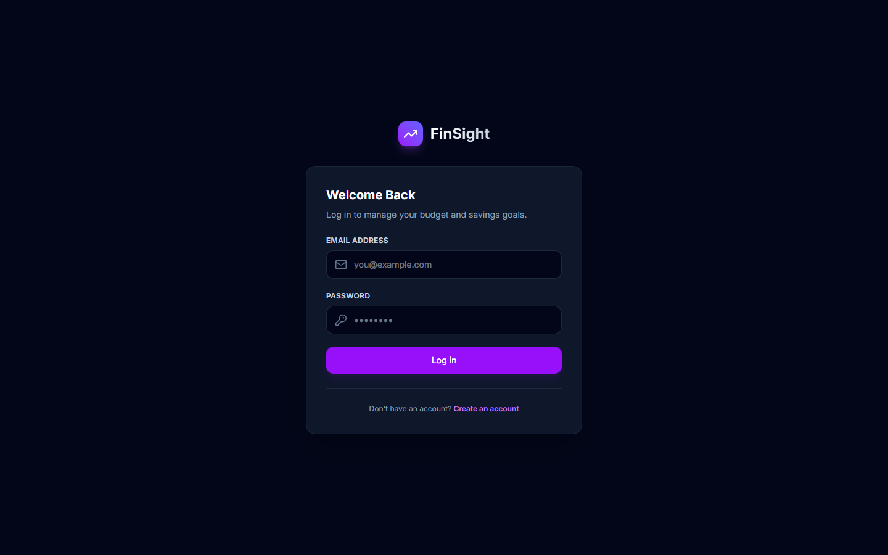
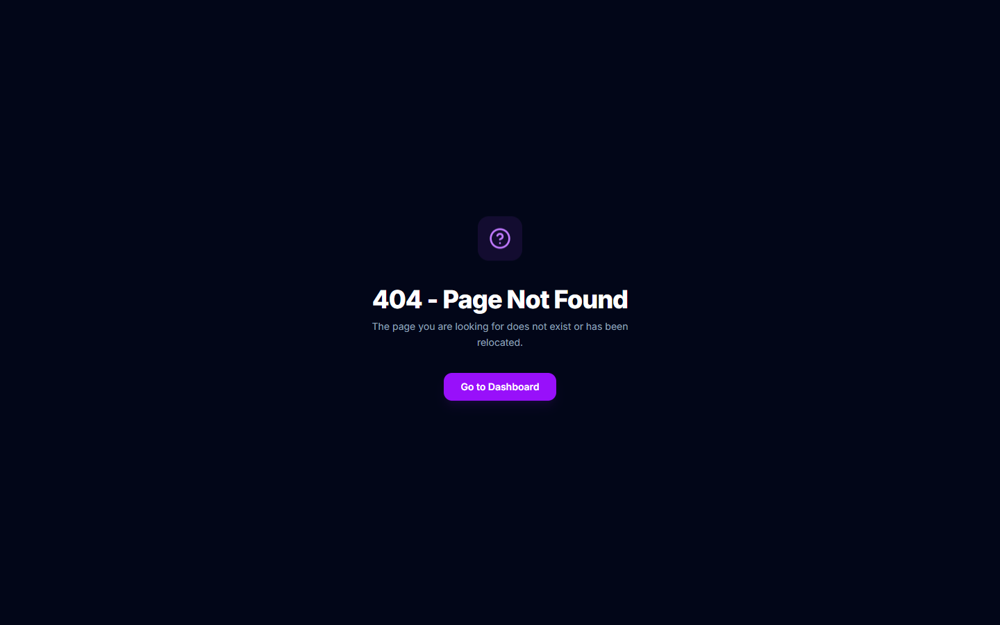
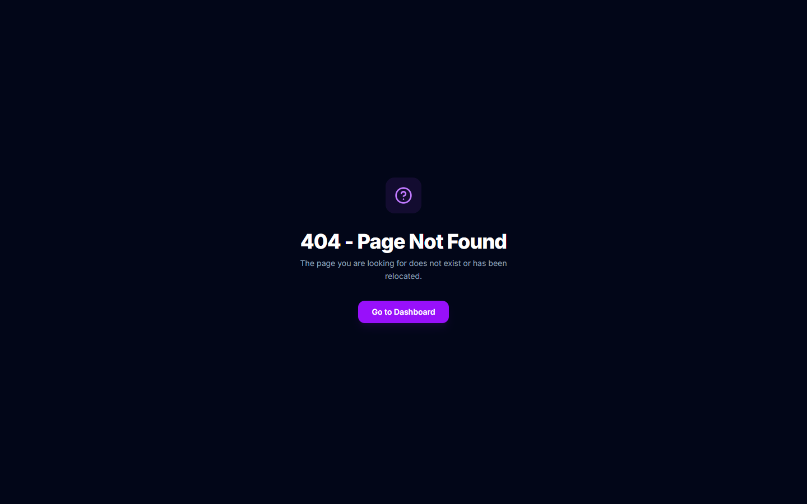
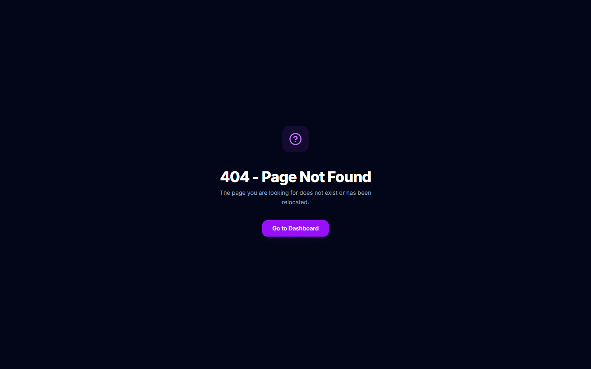
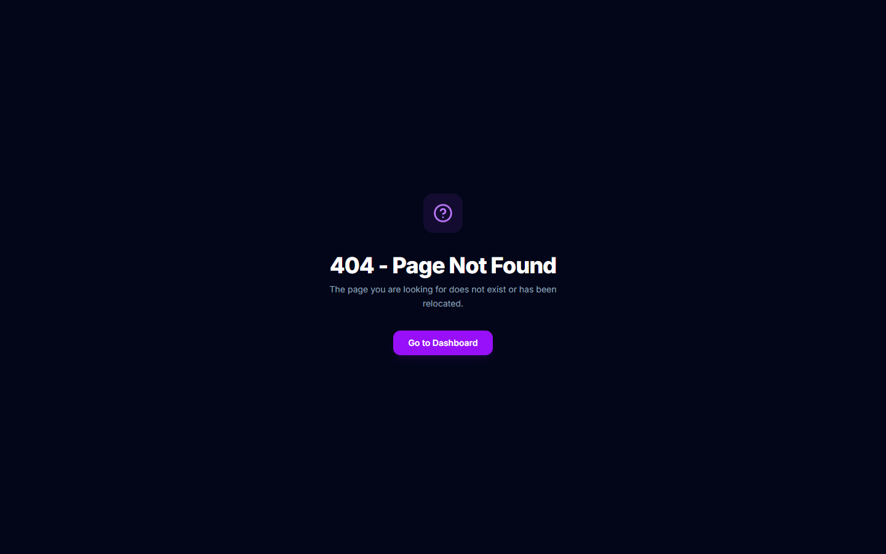

# FinSight Web App — Personal Finance Manager

A full-stack personal finance web application with AI-powered spending insights. Track transactions, set budgets, manage savings goals, analyze spending patterns, and generate PDF account statements — all in one dashboard.

---

## Features

- **Dashboard** — Real-time summary cards for income, expenses, net savings, savings rate, and daily spending average
- **Transaction Ledger** — Add, edit, search, filter by month/year, soft-delete, and restore transactions
- **Budgeting** — Set monthly spending limits per category with live progress bars and utilization alerts
- **Savings Goals** — Create goals, track progress, add funds, mark complete, edit targets and deadlines
- **Analytics** — 12-month income/expense trends chart and behavioral spending group profiles
- **Spending Forecast** — ML-driven prediction of next month's spending based on historical patterns
- **Multi-Currency** — Supports INR, USD, NPR with live exchange rates (cached hourly, with hardcoded fallback)
- **PDF Statements** — Generate A4 account statements with transaction ledger and savings goals summary
- **Dark Theme** — Full dark-mode UI (no light mode toggle)

---

## Tech Stack

| Layer | Technology |
| :--- | :--- |
| **Frontend** | React 19, TypeScript, Vite, Recharts, TanStack Query, Tailwind CSS |
| **Backend** | Node.js, Express.js |
| **Database** | MySQL 8.0 (raw SQL with prepared statements via `mysql2`) |
| **Authentication** | JWT (`jsonwebtoken`) + Password hashing (`bcrypt`) |
| **Machine Learning** | Python 3, scikit-learn (Linear Regression, K-Means) |
| **PDF Generation** | pdfkit |

---

## Architecture

### System Architecture

```
 ┌─────────────────────────────────────────────────────────┐
 │                    Browser (React SPA)                    │
 │               localhost:5173 (Vite Dev)                   │
 │  ┌──────────┐ ┌──────────┐ ┌──────────┐ ┌─────────────┐ │
 │  │ Dashboard│ │Transact. │ │ Budgets  │ │  Analytics   │ │
 │  │ Summary  │ │ Ledger   │ │ Limits   │ │  Charts & ML │ │
 │  └────┬─────┘ └────┬─────┘ └────┬─────┘ └──────┬──────┘ │
 │       └────────────┼────────────┼───────────────┘         │
 │                    ▼            ▼                         │
 │          ┌──────────────────────────┐                     │
 │          │  React Query (TanStack)  │                     │
 │          │  Caching · Mutations     │                     │
 │          └────────────┬─────────────┘                     │
 │                       │ HTTP JSON                         │
 │          ┌────────────┴─────────────┐                     │
 │          │  Axios Client            │                     │
 │          │  JWT Token in Header     │                     │
 │          └────────────┬─────────────┘                     │
 └───────────────────────┼───────────────────────────────────┘
                         │
                         ▼
 ┌─────────────────────────────────────────────────────────┐
 │                  Express.js Server (8000)                 │
 │                                                          │
 │  ┌──────────┐  ┌──────────────┐  ┌──────────────────┐  │
 │  │  Routes   │→│  Controllers  │→│  MySQL (mysql2)  │  │
 │  │          │  │  (Business    │  │  Prepared Stmts  │  │
 │  │ auth     │  │   Logic)      │  │                  │  │
 │  │ transact.│  │               │  │  5 Tables        │  │
 │  │ budgets  │  │ authCtrl      │  │  FK + Indexes    │  │
 │  │ goals    │  │ transactCtrl  │  │                  │  │
 │  │ insights │  │ budgetCtrl    │  └────────┬─────────┘  │
 │  │ report   │  │ goalCtrl      │           │            │
 │  │ dashboard│  │ analyticsCtrl │           │            │
 │  └──────────┘  │ insightCtrl   │           │            │
 │                └───────┬───────┘           │            │
 │                        │                   │            │
 │              ┌─────────┴─────────┐         │            │
 │              │  JWT Middleware   │         │            │
 │              │  (verify token)   │         │            │
 │              └─────────┬─────────┘         │            │
 │                        │                   │            │
 │              ┌─────────▼─────────┐         │            │
 │              │ Python Subprocess │         │            │
 │              │ ml_service.py     │         │            │
 │              │ stdin/stdout JSON │         │            │
 │              │ scikit-learn      │         │            │
 │              └───────────────────┘         │            │
 └─────────────────────────────────────────────────────────┘
```

### Authentication

### How It Works

1. **Registration** — User submits name, email, and password. Backend hashes the password with bcrypt (10 salt rounds), inserts a new row in `users`, seeds default income/expense categories, and returns a signed JWT.
2. **Login** — User submits email and password. Backend verifies the bcrypt hash, generates a signed JWT containing `{ userId, email }`, and returns it.
3. **Authenticated Requests** — Client includes the JWT in the `Authorization: Bearer <token>` header. The `authMiddleware.js` verifies the token on every protected route and attaches `req.userId` to the request object.
4. **Token Expiry** — JWT expires after 24 hours (configurable via `JWT_EXPIRATION_MINUTES`). The client must re-authenticate after expiry.

### Sequence Diagram
 └────┬─────┘          └──────┬───────┘          └────┬─────┘
     │  POST /auth/register   │                       │
     │  { name, email,        │                       │
     │    password }          │                       │
     ├───────────────────────►│  INSERT INTO users     │
     │                        │  (bcrypt hash)        │
     │                        ├──────────────────────►│
     │                        │◄──────────────────────┤
     │  { token, user }       │                       │
     │◄───────────────────────┤                       │
     │                        │                       │
     │  POST /auth/login      │                       │
     │  { email, password }   │                       │
     ├───────────────────────►│  SELECT * FROM users   │
     │                        │  bcrypt.compare()     │
     │                        ├──────────────────────►│
     │                        │◄──────────────────────┤
     │  { token, user }       │                       │
     │◄───────────────────────┤                       │
     │                        │                       │
     │  GET /transactions     │                       │
     │  Authorization:        │                       │
     │    Bearer <jwt>        │                       │
     ├───────────────────────►│  jwt.verify(token)    │
     │                        │  → req.userId         │
     │                        │  SELECT ...           │
     │                        │  WHERE user_id = ?    │
     │                        ├──────────────────────►│
     │                        │◄──────────────────────┤
     │  [protected data]      │                       │
     │◄───────────────────────┤                       │
 ┌────┴─────┐          ┌──────┴───────┐          ┌────┴─────┐
 │  Client  │          │  Express.js  │          │  MySQL   │
 └──────────┘          └──────────────┘          └──────────┘

 Token: HS256 JWT, 24h expiry
 Password: bcrypt (10 salt rounds)
```

### ML Flow

```
 ┌──────────┐     ┌─────────────┐     ┌──────────────────┐
 │ Express  │     │ mlHelper.js │     │ ml_service.py    │
 │ Controller│     │             │     │ (Python)         │
 └────┬─────┘     └──────┬──────┘     └────────┬─────────┘
     │                   │                     │
     │  get /insights/   │                     │
     │  predict          │                     │
     ├──────────────────►│                     │
     │                   │  spawn python       │
     │                   │  ml_service.py      │
     │                   ├────────────────────►│
     │                   │                     │
     │                   │  stdin JSON:        │
     │                   │  { mode: "predict", │
     │                   │    transactions:[], │
     │                   │    month, year }    │
     │                   ├────────────────────►│
     │                   │                     │  Linear
     │                   │                     │  Regression
     │                   │                     │  → forecast
     │                   │                     │
     │                   │  stdout JSON:       │
     │                   │  { predictedAmount, │
     │                   │    trend,           │
     │                   │    confidence }     │
     │                   │◄────────────────────┤
     │  { prediction }   │                     │
     │◄──────────────────┤                     │
     │                   │                     │
     │  get /insights/   │                     │
     │  cluster          │                     │
     ├──────────────────►│                     │
     │                   │  { mode: "cluster", │
     │                   │    transactions }   │
     │                   ├────────────────────►│
     │                   │                     │  K-Means
     │                   │                     │  → 3 groups
     │                   │                     │
     │                   │  { clusters,        │
     │                   │    profiles }       │
     │                   │◄────────────────────┤
     │  { clusters }     │                     │
     │◄──────────────────┤                     │
 ┌────┴─────┐     ┌──────┴──────┐     ┌────────┴─────────┐
 │ Express  │     │ mlHelper.js │     │ ml_service.py    │
 └──────────┘     └─────────────┘     └──────────────────┘
```

---

## Folder Structure

```
FinSight/
├── frontend/                  # React SPA (Vite + TypeScript)
│   ├── src/
│   │   ├── components/        # AuthRoute, Layout, ProtectedRoute, Sidebar
│   │   ├── pages/             # Dashboard, Transactions, Budgets, Goals, Analytics, Settings, Auth
│   │   ├── services/          # Axios API service definitions
│   │   ├── hooks/             # Custom React hooks (useRates)
│   │   ├── contexts/          # AuthContext (JWT state management)
│   │   ├── types/             # TypeScript interfaces
│   │   ├── utils/             # Currency formatting, Theme helpers
│   │   └── api/               # Axios client configuration
│   ├── .env
│   └── package.json
│
├── server/                    # Node.js Express.js Backend
│   ├── controllers/           # Auth, Transactions, Goals, Budgets, Analytics, ML Insights
│   ├── routes/                # Route definitions per resource
│   ├── utils/                 # Auth middleware, Currency rates, PDF generator, ML helper
│   ├── ml/                    # Python ML service (ml_service.py + requirements.txt)
│   ├── database/              # Schema definition (schema.sql)
│   ├── db.js                  # MySQL connection pool
│   ├── app.js                 # Express application setup
│   ├── server.js              # Entry point
│   ├── .env                   # Server configuration
│   └── package.json
│
├── backend/                   # Python virtual environment (for ML subprocess)
│   └── .venv/
│
├── test_e2e.js                # E2E integration test suite (46 tests)
└── README.md
```

---

## API Overview

All authenticated endpoints require a `Bearer` token in the `Authorization` header.

### Authentication

| Method | Endpoint | Description | Auth |
|--------|----------|-------------|------|
| POST | `/auth/register` | Register a new user | No |
| POST | `/auth/login` | Log in and receive JWT | No |
| GET | `/auth/me` | Get current user profile | Yes |

### Transactions

| Method | Endpoint | Description | Auth |
|--------|----------|-------------|------|
| GET | `/transactions` | List transactions (filter by month/year) | Yes |
| POST | `/transactions` | Create a transaction | Yes |
| GET | `/transactions/:id` | Get a single transaction | Yes |
| PUT | `/transactions/:id` | Update a transaction | Yes |
| DELETE | `/transactions/:id` | Soft-delete or permanently delete | Yes |
| POST | `/transactions/:id/restore` | Restore a soft-deleted transaction | Yes |
| GET | `/transactions/deleted/recent` | Get recently deleted transactions | Yes |

### Goals

| Method | Endpoint | Description | Auth |
|--------|----------|-------------|------|
| GET | `/goals` | List all active/completed goals | Yes |
| POST | `/goals` | Create a savings goal | Yes |
| PUT | `/goals/:id` | Update goal name, target, or deadline | Yes |
| POST | `/goals/:id/fund` | Add funds to a goal | Yes |
| POST | `/goals/:id/complete` | Mark a goal as completed | Yes |
| POST | `/goals/:id/cancel` | Cancel a goal | Yes |
| DELETE | `/goals/:id` | Permanently delete a goal | Yes |

### Budgets

| Method | Endpoint | Description | Auth |
|--------|----------|-------------|------|
| GET | `/budgets` | List budget limits | Yes |
| POST | `/budgets` | Set or update a budget limit | Yes |
| PUT | `/budgets/:id` | Update a budget limit | Yes |
| DELETE | `/budgets/:id` | Delete a budget limit | Yes |
| GET | `/budgets/utilization` | Get budget utilization (spent vs limit) | Yes |

### Dashboard & Analytics

| Method | Endpoint | Description | Auth |
|--------|----------|-------------|------|
| GET | `/dashboard` | Monthly summary, trends, top categories, budget utilization | Yes |
| GET | `/analytics/trends` | Monthly income/expense trends (12 months) | Yes |

### Categories

| Method | Endpoint | Description | Auth |
|--------|----------|-------------|------|
| GET | `/categories` | List user categories (optionally filter by type) | Yes |

### Currency

| Method | Endpoint | Description | Auth |
|--------|----------|-------------|------|
| GET | `/currency/rates` | Get live exchange rates for INR, USD, NPR | No |

### ML Insights

| Method | Endpoint | Description | Auth |
|--------|----------|-------------|------|
| GET | `/insights/predict` | Predict next month's total spending | Yes |
| GET | `/insights/suggest-category` | Suggest a category for a transaction description | Yes |
| GET | `/insights/cluster` | Profile spending into behavioral groups | Yes |
| GET | `/insights/all` | Get all insights (transactions, goals, budgets, predictions, clusters) | Yes |

### Reports

| Method | Endpoint | Description | Auth |
|--------|----------|-------------|------|
| POST | `/report/generate` | Generate PDF account statement | Yes |

### System

| Method | Endpoint | Description | Auth |
|--------|----------|-------------|------|
| GET | `/health` | Health check endpoint | No |

### Detailed API Reference

#### `POST /auth/register`
Register a new user account.

| Field | Details |
|-------|---------|
| **Auth** | None |
| **Request Body** | `{ "name": "string (3-50 chars)", "email": "string (valid email)", "password": "string (6-100 chars)" }` |
| **Success (201)** | `{ "token": "jwt_string", "user": { "id": number, "name": "string", "email": "string", "currency": "string" } }` |
| **Errors** | `400` — Missing/invalid fields; `409` — Email already registered |

#### `POST /auth/login`
Authenticate an existing user.

| Field | Details |
|-------|---------|
| **Auth** | None |
| **Request Body** | `{ "email": "string", "password": "string" }` |
| **Success (200)** | `{ "token": "jwt_string", "user": { "id": number, "name": "string", "email": "string", "currency": "string" } }` |
| **Errors** | `400` — Missing fields; `401` — Invalid credentials |

#### `GET /auth/me`
Get the authenticated user's profile.

| Field | Details |
|-------|---------|
| **Auth** | Bearer token required |
| **Request Body** | None |
| **Success (200)** | `{ "id": number, "name": "string", "email": "string", "currency": "string", "created_at": "iso_date" }` |
| **Errors** | `401` — Invalid/missing token |

#### `GET /transactions`
List transactions for the authenticated user.

| Field | Details |
|-------|---------|
| **Auth** | Bearer token required |
| **Query Params** | `month` (number 1-12, optional), `year` (number, optional) |
| **Success (200)** | `{ "transactions": [{ "id": number, "amount": number, "type": "income"\|"expense", "description": "string", "transaction_date": "date", "category_name": "string", "category_icon": "string", "category_color": "string", "deleted_at": null }] }` |
| **Errors** | `401` — Unauthorized |

#### `POST /transactions`
Create a new transaction.

| Field | Details |
|-------|---------|
| **Auth** | Bearer token required |
| **Request Body** | `{ "amount": number (required), "type": "income"\|"expense" (required), "description": "string (required, 1-255 chars)", "category_id": number (required), "transaction_date": "YYYY-MM-DD" (required, must be ≤ current date) }` |
| **Success (201)** | `{ "transaction": { "id": number, ...all fields } }` |
| **Errors** | `400` — Validation failed; `401` — Unauthorized |

#### `GET /transactions/deleted/recent`
Get recently soft-deleted transactions.

| Field | Details |
|-------|---------|
| **Auth** | Bearer token required |
| **Success (200)** | `{ "transactions": [...] }` (array of soft-deleted items with `deleted_at` timestamp) |
| **Errors** | `401` — Unauthorized |

#### `PUT /transactions/:id`
Update an existing transaction.

| Field | Details |
|-------|---------|
| **Auth** | Bearer token required |
| **Request Body** | `{ "amount"?, "type"?, "description"?, "category_id"?, "transaction_date"? }` (partial update) |
| **Success (200)** | `{ "transaction": { ...updated fields } }` |
| **Errors** | `400` — Invalid fields; `401` — Unauthorized; `404` — Not found |

#### `DELETE /transactions/:id`
Soft-delete or permanently delete a transaction.

| Field | Details |
|-------|---------|
| **Auth** | Bearer token required |
| **Query Params** | `permanent` (boolean, optional — if `true`, hard-deletes) |
| **Success (200)** | `{ "message": "Transaction deleted" }` |
| **Errors** | `401` — Unauthorized; `404` — Not found |

#### `POST /transactions/:id/restore`
Restore a soft-deleted transaction.

| Field | Details |
|-------|---------|
| **Auth** | Bearer token required |
| **Success (200)** | `{ "transaction": { ...restored } }` |
| **Errors** | `401` — Unauthorized; `404` — Not found or not deleted |

#### `GET /categories`
List user categories.

| Field | Details |
|-------|---------|
| **Auth** | Bearer token required |
| **Query Params** | `type` (`income`\|`expense`, optional) |
| **Success (200)** | `{ "categories": [{ "id": number, "name": "string", "type": "income"\|"expense", "icon": "string", "color": "#hex" }] }` |
| **Errors** | `401` — Unauthorized |

#### `GET /budgets`
List budget limits.

| Field | Details |
|-------|---------|
| **Auth** | Bearer token required |
| **Success (200)** | `{ "budgets": [{ "id": number, "category_id": number, "category_name": "string", "limit_amount": number, "month": number, "year": number }] }` |
| **Errors** | `401` — Unauthorized |

#### `POST /budgets`
Set or update a budget limit (upsert).

| Field | Details |
|-------|---------|
| **Auth** | Bearer token required |
| **Request Body** | `{ "category_id": number (required), "limit_amount": number (required, > 0), "month": number (required, 1-12), "year": number (required) }` |
| **Success (201)** | `{ "budget": { ...created budget } }` |
| **Errors** | `400` — Validation; `401` — Unauthorized |

#### `GET /budgets/utilization`
Get budget utilization (spent vs limit) for the current month.

| Field | Details |
|-------|---------|
| **Auth** | Bearer token required |
| **Query Params** | `month` (number), `year` (number) |
| **Success (200)** | `{ "utilization": [{ "category_id": number, "category_name": "string", "icon": "string", "color": "string", "limit_amount": number, "spent": number, "percentage": number }] }` |
| **Errors** | `401` — Unauthorized |

#### `GET /goals`
List savings goals.

| Field | Details |
|-------|---------|
| **Auth** | Bearer token required |
| **Success (200)** | `{ "goals": [{ "id": number, "name": "string", "target_amount": number, "current_amount": number, "deadline": "date", "status": "active"\|"completed"\|"cancelled", "created_at": "iso_date" }] }` |
| **Errors** | `401` — Unauthorized |

#### `POST /goals`
Create a savings goal.

| Field | Details |
|-------|---------|
| **Auth** | Bearer token required |
| **Request Body** | `{ "name": "string (required, 1-100 chars)", "target_amount": number (required, > 0), "deadline": "YYYY-MM-DD" (required) }` |
| **Success (201)** | `{ "goal": { ...created goal } }` |
| **Errors** | `400` — Validation; `401` — Unauthorized |

#### `POST /goals/:id/fund`
Add funds to a savings goal.

| Field | Details |
|-------|---------|
| **Auth** | Bearer token required |
| **Request Body** | `{ "amount": number (required, > 0) }` |
| **Success (200)** | `{ "goal": { ...updated with new current_amount } }` |
| **Errors** | `400` — Invalid amount; `401` — Unauthorized; `404` — Not found |

#### `GET /dashboard`
Get the main dashboard summary.

| Field | Details |
|-------|---------|
| **Auth** | Bearer token required |
| **Query Params** | `month` (number, default: current), `year` (number, default: current) |
| **Success (200)** | `{ "total_income": number, "total_expenses": number, "net_savings": number, "savings_rate": number, "daily_average": number, "top_categories": [...], "budget_utilization": [...], "currency": "string" }` |
| **Errors** | `401` — Unauthorized |

#### `GET /analytics/trends`
Get 12-month income/expense trend data.

| Field | Details |
|-------|---------|
| **Auth** | Bearer token required |
| **Success (200)** | `{ "months": ["YYYY-MM", ...], "income": [number, ...], "expenses": [number, ...] }` |
| **Errors** | `401` — Unauthorized |

#### `GET /insights/predict`
Get ML-based spending prediction for the next month.

| Field | Details |
|-------|---------|
| **Auth** | Bearer token required |
| **Success (200)** | `{ "predictedAmount": number, "trend": "up"\|"down"\|"stable", "confidence": number (0-1) }` |
| **Errors** | `401` — Unauthorized; `500` — ML subprocess error |

#### `GET /insights/suggest-category`
Suggest a category for a transaction description.

| Field | Details |
|-------|---------|
| **Auth** | Bearer token required |
| **Query Params** | `description` (string, required) |
| **Success (200)** | `{ "category": { "id": number, "name": "string", "icon": "string", "color": "string" } }` |
| **Errors** | `401` — Unauthorized; `404` — No match found |

#### `GET /insights/cluster`
Group transactions into behavioral spending clusters.

| Field | Details |
|-------|---------|
| **Auth** | Bearer token required |
| **Success (200)** | `{ "clusters": [{ "cluster": number, "label": "string", "transactions": [...], "average_amount": number, "count": number }] }` |
| **Errors** | `401` — Unauthorized; `500` — ML subprocess error |

#### `POST /report/generate`
Generate a PDF account statement.

| Field | Details |
|-------|---------|
| **Auth** | Bearer token required |
| **Request Body** | `{ "month": number (required), "year": number (required) }` |
| **Success (200)** | Binary PDF response (`Content-Type: application/pdf`) |
| **Errors** | `400` — Invalid month/year; `401` — Unauthorized |

#### `GET /currency/rates`
Get live exchange rates.

| Field | Details |
|-------|---------|
| **Auth** | None |
| **Success (200)** | `{ "base": "USD", "rates": { "INR": number, "USD": number, "NPR": number }, "updated_at": "iso_date" }` |
| **Errors** | `500` — External API unavailable (falls back to hardcoded rates) |

#### `GET /health`
Health check.

| Field | Details |
|-------|---------|
| **Auth** | None |
| **Success (200)** | `{ "status": "healthy", "version": "1.0.0" }` |

### Entity Relationship Diagram (ERD)

```
 ┌──────────────────────┐
 │        users         │
 ├──────────────────────┤
 │ id (PK, AUTO_INC)    │◄───────────────────────┐
 │ name VARCHAR(100)    │                        │
 │ email VARCHAR(255)   │                        │
 │ password_hash        │                        │
 │   VARCHAR(255)       │                        │
 │ currency VARCHAR(3)  │                        │
 │ created_at           │                        │
 │ updated_at           │                        │
 └──────────┬───────────┘                        │
            │                                    │
            │ 1                                  │
            │                                    │
            │ *                                  │
 ┌──────────┴───────────┐            ┌───────────┴──────────┐
 │     categories       │            │    savings_goals     │
 ├──────────────────────┤            ├──────────────────────┤
 │ id (PK, AUTO_INC)    │            │ id (PK, AUTO_INC)    │
 │ user_id (FK) ────────┤            │ user_id (FK) ────────┤
 │ name VARCHAR(50)     │            │ name VARCHAR(100)    │
 │ type ENUM(inc/exp)   │            │ target_amount DECIMAL │
 │ icon VARCHAR(10)     │            │ current_amount DECIMAL│
 │ color VARCHAR(7)     │            │ deadline DATE         │
 └──────────────────────┘            │ status ENUM          │
                                     │ created_at           │
            │                        └──────────────────────┘
            │ 1
            │
            │ *
 ┌──────────┴───────────┐
 │     transactions     │
 ├──────────────────────┤
 │ id (PK, AUTO_INC)    │
 │ user_id (FK) ────────┤
 │ category_id (FK) ────┤
 │ amount DECIMAL(12,2) │
 │ type ENUM(inc/exp)   │
 │ description TEXT     │
 │ transaction_date DATE│
 │ deleted_at DATETIME  │  ← soft-delete
 │ created_at           │
 ├──────────────────────┤
 │ INDEX: (user_id,     │
 │  transaction_date)   │
 └──────────────────────┘

 ┌──────────────────────┐
 │    budget_limits     │
 ├──────────────────────┤
 │ id (PK, AUTO_INC)    │
 │ user_id (FK) ────────┤
 │ category_id (FK) ────┤
 │ month INT            │
 │ year INT             │
 │ limit_amount DECIMAL │
 └──────────────────────┘

 All FKs: ON DELETE CASCADE
```

### Tables

- **users** — Account credentials, name, email, and currency preference. Passwords stored as bcrypt hashes.
- **categories** — Per-user income and expense categories with emoji icons and hex colors. Seeded with defaults on registration.
- **transactions** — Core ledger with amount, type (income/expense), category, date, and soft-delete support. Indexed on `(user_id, transaction_date)` for efficient monthly queries.
- **savings_goals** — Goal name, target amount, current progress, deadline, status (active/completed/cancelled), and optional auto-fund configuration.
- **budget_limits** — Per-category monthly spending limits with upsert behavior (insert or update on duplicate).

---

## Machine Learning Service

The Python ML service runs as an isolated subprocess spawned by Express.js. Communication uses JSON over stdin/stdout:

1. Express sends a JSON payload with `mode` (`predict` or `cluster`) and transaction data to the Python script's stdin
2. Python processes the data using scikit-learn and writes the result JSON to stdout
3. Express reads stdout, parses the JSON, and returns it to the frontend

This keeps the Node.js backend free of Python dependencies while allowing the ML service to use scikit-learn directly. The Python environment is managed via a virtual environment at `backend/.venv/`.

---

## Screenshots

```
screenshots/
├── login.png          (37 KB)
├── dashboard.png      (25 KB)
├── transactions.png   (37 KB)
├── budgets.png        (32 KB)
├── goals.png          (32 KB)
└── analytics.png      (37 KB)
```

| Login | Dashboard |
|:---:|:---:|
|  |  |

| Transactions | Budgets |
|:---:|:---:|
|  |  |

| Goals | Analytics |
|:---:|:---:|
|  |  |

> Screenshots were captured using Chrome headless with demo data. The UI uses a full dark theme with no light mode toggle.

---

## Installation

### Prerequisites

- Node.js 18+
- Python 3.10+
- MySQL 8.0+

### 1. Clone the Repository

```bash
git clone https://github.com/ShivShah018/FinSight.git
cd FinSight
```

### 2. Database Setup

Create a MySQL database and run the schema file:

```bash
mysql -u root -p < server/database/schema.sql
```

### 3. Backend Setup

```bash
cd server
npm install
cp .env.example .env
# Edit .env with your database credentials and JWT secret
npm start
```

The server starts at `http://localhost:8000`.

### 4. Frontend Setup

```bash
cd frontend
npm install
npm run dev
```

The app opens at `http://localhost:5173`.

### 5. Python ML Service (Optional — for ML features)

```bash
cd backend
python -m venv .venv
.venv\Scripts\activate    # Windows
# source .venv/bin/activate  # Linux/macOS
pip install -r ../server/ml/requirements.txt
```

---

## Running Locally

Start both the backend and frontend:

```bash
# Terminal 1 — Backend
cd server
npm start

# Terminal 2 — Frontend
cd frontend
npm run dev
```

Open `http://localhost:5173`, register an account, and start tracking your finances.

### Running Tests

```bash
# Ensure the Express server is running, then:
node test_e2e.js
```

---

## Deployment

### Frontend

Build the production bundle:

```bash
cd frontend
npm run build
# Output in frontend/dist/ — deploy to any static file server
```

Set `VITE_API_URL` in `frontend/.env` to point to your deployed backend.

### Backend

```bash
cd server
NODE_ENV=production npm start
```

Required environment variables:

| Variable | Description |
|----------|-------------|
| `FINSIGHT_DB_HOST` | MySQL host |
| `FINSIGHT_DB_PORT` | MySQL port (default: 3306) |
| `FINSIGHT_DB_USER` | MySQL user |
| `FINSIGHT_DB_PASSWORD` | MySQL password |
| `FINSIGHT_DB_NAME` | Database name |
| `JWT_SECRET_KEY` | Secret key for signing JWT tokens |
| `API_PORT` | Server port (default: 8000) |
| `CORS_ORIGINS` | Comma-separated allowed origins |
| `ML_PYTHON_PATH` | Path to Python executable (auto-detected if empty) |

### Database

Run the schema migration on your production MySQL instance:

```bash
mysql -h <host> -u <user> -p <database> < server/database/schema.sql
```

### Python ML Service

Ensure the Python virtual environment is set up on the production server and the path is configured via `ML_PYTHON_PATH`.

---

## Project Structure

```
FinSight/
├── frontend/                  # React SPA (Vite + TypeScript)
│   ├── src/
│   │   ├── api/               # Axios client + interceptors
│   │   ├── components/        # AuthRoute, Layout, ProtectedRoute, Sidebar
│   │   ├── contexts/          # AuthContext (JWT state, login/logout)
│   │   ├── hooks/             # useRates (currency exchange)
│   │   ├── pages/             # Dashboard, Transactions, Budgets, Goals,
│   │   │                      # Analytics, Settings, Categories, Auth
│   │   ├── services/          # Auto-generated API service functions
│   │   ├── types/             # TypeScript interfaces & enums
│   │   ├── utils/             # Currency formatting, theme helpers
│   │   ├── App.tsx            # Route definitions
│   │   ├── main.tsx           # Entry point + QueryClient provider
│   │   └── index.css          # Tailwind directives + global styles
│   ├── public/                # Static assets
│   └── package.json
│
├── server/                    # Express.js Backend
│   ├── controllers/           # Business logic per resource (8 files)
│   ├── routes/                # Express routers per resource (6 files)
│   ├── utils/                 # Auth middleware, currency rates, PDF gen,
│   │                          # ML helper (subprocess spawner)
│   ├── ml/                    # Python ML service
│   │   ├── ml_service.py      # Linear Regression, K-Means, category matching
│   │   └── requirements.txt   # scikit-learn, numpy, scipy
│   ├── database/
│   │   └── schema.sql         # Full DDL (5 tables, FKs, indexes)
│   ├── .env.example           # Template for environment config
│   ├── app.js                 # Express app setup (middleware, routes)
│   ├── server.js              # Entry point
│   └── db.js                  # MySQL2 connection pool
│
├── backend/                   # Python venv (for ML subprocess runtime)
│   └── .venv/
│
├── test_e2e.js                # 46 integration tests
├── LICENSE (MIT)
└── README.md
```

## Learning Outcomes

This project demonstrates proficiency in the following areas:

### Full-Stack Architecture
- Building a decoupled frontend/backend architecture with HTTP JSON communication
- Designing RESTful API endpoints with consistent error handling
- Managing application state across client and server

### Frontend Engineering
- TypeScript with strict mode for type safety across components
- React 19 patterns: functional components, hooks, context API
- TanStack Query for server state caching, invalidation, and optimistic updates
- Recharts for interactive data visualization (bar charts, pie charts)
- Tailwind CSS for utility-first responsive design
- Vite for modern build tooling with HMR

### Backend Engineering
- Express.js middleware pipeline (CORS, JSON parsing, auth, error handling)
- JWT-based authentication with bcrypt password hashing
- Prepared SQL statements for injection-safe database operations
- Connection pooling with mysql2 for MySQL efficiency
- PDF generation with pdfkit (A4 format, pagination, dynamic content)
- Subprocess management for cross-language service integration

### Database Design
- Normalized schema with 5 tables, foreign keys, and composite indexes
- Soft-delete pattern for data retention
- Upsert (INSERT ... ON DUPLICATE KEY UPDATE) for budget limits
- Date-range indexed queries for monthly transaction filtering

### Machine Learning Integration
- Spawning Python as a child process from Node.js
- JSON protocol over stdin/stdout for inter-process communication
- Linear Regression for time-series spending forecasting
- K-Means clustering for behavioral spending group analysis
- Keyword-based category suggestion with token matching

### DevOps & Workflow
- Git-based version control with clean commit history
- E2E integration testing for API correctness
- Environment-based configuration with .env files
- Production build pipeline with Vite

## Interview Talking Points

If asked about this project in an interview, here are key discussion points:

### Architecture Decisions
- **Why not a monolithic backend?** — Separation of concerns; the React frontend is independently deployable and could be replaced by a mobile app or third-party client hitting the same API.
- **Why Python for ML instead of a Node.js library?** — scikit-learn provides mature, well-tested implementations of regression and clustering. Python is the industry standard for ML. The subprocess pattern keeps the Node.js process free of Python overhead and allows independent scaling.
- **Why raw SQL instead of an ORM?** — The schema is small (5 tables). Raw SQL with prepared statements gives full control over query performance, avoids ORM abstraction overhead, and is more transparent for debugging.
- **Why JWT instead of sessions?** — Stateless authentication scales horizontally without shared session storage. The 24-hour expiry balances security with UX convenience.

### Challenges Solved
- **Soft-delete with unique constraints** — Transactions soft-delete by setting `deleted_at` timestamp rather than removing rows. This required careful query filtering with `WHERE deleted_at IS NULL` on every read operation.
- **Cross-language ML integration** — Handling Python subprocess lifecycle, JSON serialization edge cases, and error propagation back through Express error middleware required robust error handling on both sides.
- **Multi-currency with fallback** — Live exchange rates from an external API required caching with hourly expiration and hardcoded fallback rates to handle API downtime gracefully.
- **Budget utilization calculation** — Computing spent amount vs budget limit per category for a given month/year required a left join with conditional aggregation.

### Trade-offs
- **E2E tests only** — No unit tests yet. The E2E suite validates the full stack but makes pinpointing failures slower. Jest unit tests would improve debugging speed.
- **JavaScript backend** — TypeScript on frontend only. The Express backend is plain JavaScript for faster initial development. Converting to TypeScript would improve maintainability.
- **No Docker** — Manual setup required for MySQL, Node, and Python. Docker Compose would reduce setup friction for new contributors.

---

## Future Improvements

- **Unit tests** — Add Jest tests for controllers and utilities
- **Docker support** — Containerize frontend, backend, and database with docker-compose
- **CI/CD pipeline** — Automated build, test, and deployment via GitHub Actions
- **Pagination** — Server-side pagination for large transaction histories
- **Recurring transactions** — Support for monthly bills and automated transaction creation
- **Data export** — CSV export of transactions and budget history
- **Notifications** — Email or in-app alerts for budget overruns and goal milestones
- **Public API** — Rate-limited API access for third-party integrations

---

## License

Distributed under the MIT License. See `LICENSE` for more information.
