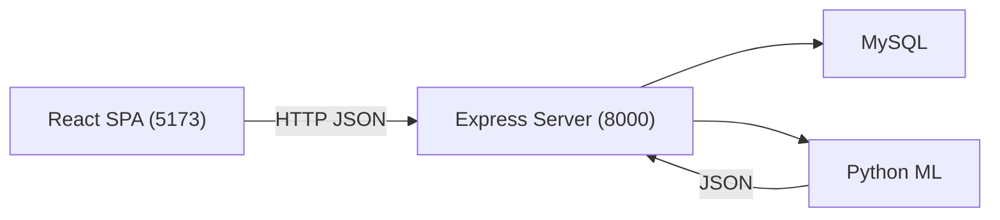
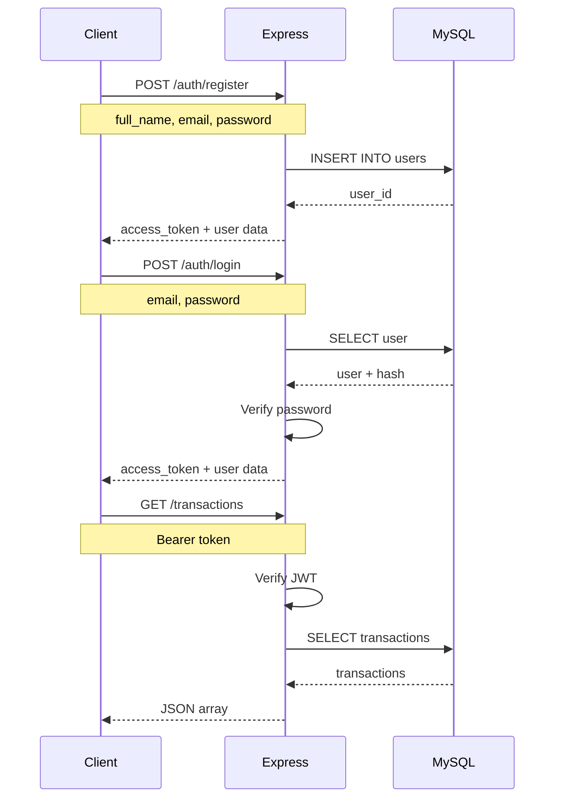
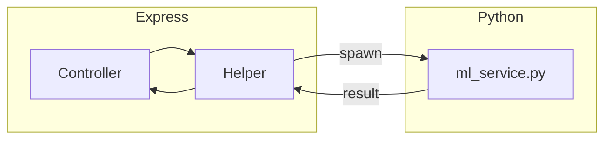
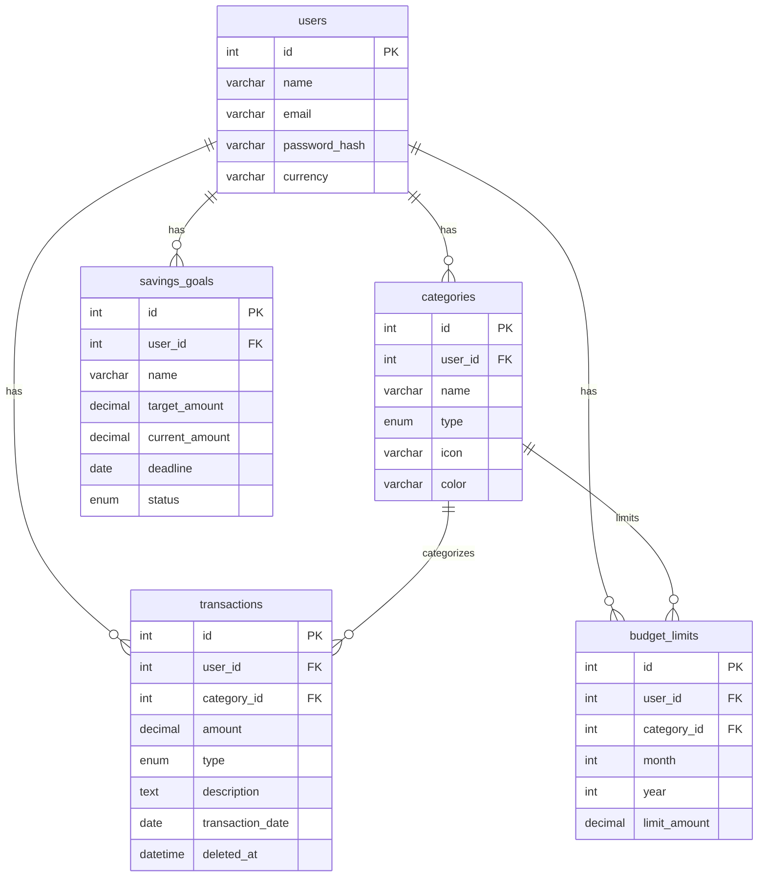
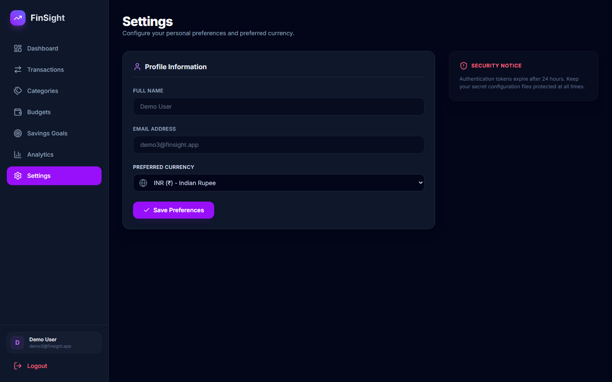

# FinSight

A full-stack personal finance manager with AI-powered spending insights. Track transactions, set budgets, manage savings goals, visualize spending patterns, and generate PDF statements.

## Features

- **Dashboard** — Income/expense summary, savings rate, daily average, top spending categories
- **Transaction Ledger** — Add, edit, search, filter by month/year, soft-delete, restore
- **Budgeting** — Monthly spending limits per category with live utilization bars
- **Savings Goals** — Create, fund, track progress, complete, or cancel
- **Analytics** — 12-month income/expense trends, behavioral spending group profiles
- **Spending Forecast** — ML-driven prediction of next month's spending via Linear Regression
- **Multi-Currency** — INR, USD, NPR with live exchange rates and hourly cache
- **PDF Statements** — A4 account statements with transaction ledger and goals summary
- **Dark Theme** — Full dark-mode UI

## Tech Stack

| Layer | Technology |
| :--- | :--- |
| Frontend | React 19, TypeScript, Vite, Recharts, TanStack Query, Tailwind CSS |
| Backend | Node.js, Express.js |
| Database | MySQL 8.0 (prepared statements via mysql2) |
| Auth | JWT (jsonwebtoken) + bcrypt |
| ML | Python 3, scikit-learn (Linear Regression, K-Means) |
| PDF | pdfkit |

## Architecture



### Authentication Flow



### ML Flow



## Folder Structure

```text
FinSight/
├── frontend/
│   ├── src/
│   │   ├── api/
│   │   ├── components/
│   │   ├── contexts/
│   │   ├── hooks/
│   │   ├── pages/
│   │   ├── types/
│   │   └── utils/
│   ├── package.json
│   └── .env
│
├── server/
│   ├── controllers/
│   ├── routes/
│   ├── utils/
│   ├── ml/
│   ├── database/
│   ├── db.js
│   ├── app.js
│   ├── server.js
│   ├── package.json
│   └── .env
│
├── README.md
└── test_e2e.js
```

## API Overview

All authenticated endpoints require `Authorization: Bearer <token>`.

### Authentication

| Method | Endpoint | Auth |
|--------|----------|------|
| POST | `/auth/register` | No |
| POST | `/auth/login` | No |
| GET | `/auth/me` | Yes |

### Transactions

| Method | Endpoint | Auth |
|--------|----------|------|
| GET | `/transactions` | Yes |
| POST | `/transactions` | Yes |
| GET | `/transactions/:id` | Yes |
| PUT | `/transactions/:id` | Yes |
| DELETE | `/transactions/:id` | Yes |
| POST | `/transactions/:id/restore` | Yes |
| GET | `/transactions/deleted/recent` | Yes |

### Goals

| Method | Endpoint | Auth |
|--------|----------|------|
| GET | `/goals` | Yes |
| POST | `/goals` | Yes |
| PUT | `/goals/:id` | Yes |
| POST | `/goals/:id/fund` | Yes |
| POST | `/goals/:id/complete` | Yes |
| POST | `/goals/:id/cancel` | Yes |
| DELETE | `/goals/:id` | Yes |

### Budgets

| Method | Endpoint | Auth |
|--------|----------|------|
| GET | `/budgets` | Yes |
| POST | `/budgets` | Yes |
| PUT | `/budgets/:id` | Yes |
| DELETE | `/budgets/:id` | Yes |
| GET | `/budgets/utilization` | Yes |

### Dashboard & Analytics

| Method | Endpoint | Auth |
|--------|----------|------|
| GET | `/dashboard` | Yes |
| GET | `/analytics/trends` | Yes |

### Categories

| Method | Endpoint | Auth |
|--------|----------|------|
| GET | `/categories` | Yes |

### ML Insights

| Method | Endpoint | Auth |
|--------|----------|------|
| GET | `/insights/predict` | Yes |
| GET | `/insights/suggest-category` | Yes |
| GET | `/insights/cluster` | Yes |
| GET | `/insights/all` | Yes |

### Reports

| Method | Endpoint | Auth |
|--------|----------|------|
| POST | `/report/generate` | Yes |

### Currency & System

| Method | Endpoint | Auth |
|--------|----------|------|
| GET | `/currency/rates` | No |
| GET | `/health` | No |

## Database Design



### Tables

- **users** — Account credentials, name, email, bcrypt password hash, currency preference
- **categories** — Per-user income/expense categories with emoji icon and hex color. Seeded on registration.
- **transactions** — Core ledger. Amount, type, category, date. Soft-delete via `deleted_at`. Indexed on `(user_id, transaction_date)`.
- **savings_goals** — Target amount, progress, deadline, status (active/completed/cancelled).
- **budget_limits** — Per-category monthly limit with upsert behavior.

All child tables reference `users(id)` via foreign keys with `ON DELETE CASCADE`.

## Machine Learning

The Python ML service runs as an isolated subprocess spawned by Express.js. Communication uses JSON over stdin/stdout.

1. Express sends `{ mode: "predict" | "cluster", transactions }` to Python's stdin
2. Python processes with scikit-learn and writes JSON result to stdout
3. Express reads stdout and returns the result to the frontend

This keeps Node.js free of Python dependencies while leveraging scikit-learn. The Python environment is at `backend/.venv/`.

## Screenshots

| Login | Dashboard |
|:---:|:---:|
|  |  |

| Transactions | Budgets |
|:---:|:---:|
|  |  |

| Goals | Analytics |
|:---:|:---:|
|  |  |

| Settings | |
|:---:|:---:|
|  | |

## Installation

### Prerequisites

- Node.js 18+
- Python 3.10+
- MySQL 8.0+

### 1. Clone

```bash
git clone https://github.com/ShivShah018/FinSight.git
cd FinSight
```

### 2. Database

```bash
mysql -u root -p < server/database/schema.sql
```

### 3. Backend

```bash
cd server
npm install
cp .env.example .env
# Edit .env with your database credentials
npm start
```

Server starts at `http://localhost:8000`.

### 4. Frontend

```bash
cd frontend
npm install
npm run dev
```

App opens at `http://localhost:5173`.

### 5. Python ML (optional)

```bash
cd backend
python -m venv .venv
.venv\Scripts\activate    # Windows
# source .venv/bin/activate  # Linux/macOS
pip install -r ../server/ml/requirements.txt
```

## Running Locally

```bash
# Terminal 1
cd server && npm start

# Terminal 2
cd frontend && npm run dev
```

Open `http://localhost:5173`, register, and start tracking.

### Tests

```bash
# Ensure server is running, then:
node test_e2e.js
```

## Deployment

### Frontend

```bash
cd frontend
npm run build
# Deploy frontend/dist/ to any static server
```

Set `VITE_API_URL` to your deployed backend URL.

### Backend

```bash
cd server
NODE_ENV=production npm start
```

### Environment Variables

| Variable | Description |
|----------|-------------|
| `FINSIGHT_DB_HOST` | MySQL host |
| `FINSIGHT_DB_PORT` | MySQL port (default 3306) |
| `FINSIGHT_DB_USER` | MySQL user |
| `FINSIGHT_DB_PASSWORD` | MySQL password |
| `FINSIGHT_DB_NAME` | Database name |
| `JWT_SECRET_KEY` | JWT signing secret |
| `API_PORT` | Server port (default 8000) |
| `CORS_ORIGINS` | Comma-separated allowed origins |
| `ML_PYTHON_PATH` | Python executable path (auto-detected) |

### Database

```bash
mysql -h <host> -u <user> -p <database> < server/database/schema.sql
```

### Python ML

Ensure the virtual environment is set up and `ML_PYTHON_PATH` is configured on the production server.

## Learning Outcomes

### Full-Stack Architecture
- Decoupled frontend/backend with HTTP JSON communication
- RESTful API design with consistent error handling

### Frontend Engineering
- TypeScript strict mode, React 19 hooks and context
- TanStack Query for caching and mutations
- Recharts for interactive data visualization
- Tailwind CSS responsive design, Vite build tooling

### Backend Engineering
- Express middleware pipeline (CORS, JWT auth, error handling)
- Prepared SQL statements for injection-safe database access
- Connection pooling, PDF generation, subprocess management

### Database Design
- Normalized 5-table schema with foreign keys and composite indexes
- Soft-delete pattern with filtered queries

### Machine Learning Integration
- Python child process from Node.js with JSON protocol
- Linear Regression for time-series forecasting
- K-Means for behavioral clustering

### DevOps
- Git version control, E2E testing, env-based configuration

## Interview Talking Points

### Architecture Decisions
- **Why not monolithic?** — Frontend is independently deployable; same API could serve a mobile app.
- **Why Python for ML?** — scikit-learn is the ML standard. Subprocess pattern keeps Node.js decoupled.
- **Why raw SQL?** — Small schema (5 tables). Prepared statements give full query control without ORM overhead.
- **Why JWT?** — Stateless auth scales horizontally. 24h expiry balances security and UX.

### Challenges Solved
- Soft-delete with filtered queries (`WHERE deleted_at IS NULL`)
- Cross-language ML lifecycle and error propagation
- Multi-currency with hourly cache and hardcoded fallback
- Budget utilization via left join with conditional aggregation

### Trade-offs
- **E2E tests only** — Validates full stack but slower debugging. Jest would help.
- **JS backend** — Faster initial dev. TypeScript would improve maintainability.
- **No Docker** — Manual MySQL/Node/Python setup. Docker Compose would simplify.

## Future Improvements

- Unit tests (Jest), Docker + docker-compose, CI/CD via GitHub Actions
- Server-side pagination, recurring transactions, CSV export
- Email/in-app notifications, public API

## License

MIT. See `LICENSE` for details.
